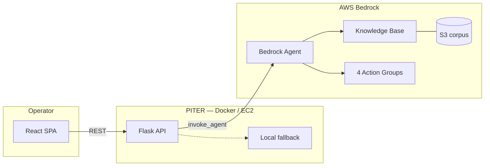

# PITER AiOps

**Agentic incident response for NOC, SRE, and DevOps** — grounded triage from runbooks, enrichment tools, and safe escalation previews.

Built by [Re'em Mor](https://github.com/reem-mor) · AI Engineer × SRE · [Learning archive](https://github.com/reem-mor/ai-engineering-portfolio)

<p align="center">
  <a href="#try-it-locally">Try it</a> ·
  <a href="#how-it-works">Architecture</a> ·
  <a href="#5-minute-demo">Demo flow</a> ·
  <a href="#documentation">Docs</a> ·
  <a href="#testing">Tests</a>
</p>

<p align="center">
  <a href="https://github.com/reem-mor/piter-aiops/actions/workflows/ci.yml"></a>
  
  
  
  
  
</p>


## At a glance

| | |
|---|---|
| **Problem** | On-call engineers lose minutes hunting runbooks while severity climbs. |
| **Approach** | Bedrock **Agent** + **Knowledge Base RAG** + four **Action Group** tools + React ops console. |
| **Safety default** | Escalation is **preview-only** — no SMS/email unless you explicitly enable live dispatch. |
| **Offline path** | Local TF-IDF fallback when Bedrock is unavailable (`PITER_LOCAL_FALLBACK=true`). |

**P**riority · **I**nvestigation · **T**riage · **E**scalation · **R**esolution

---

## Try it locally

> **SPA:** `app/static/spa/` is gitignored. Build the frontend before Docker or Flask.

```powershell
git clone https://github.com/reem-mor/piter-aiops.git
cd piter-aiops
py -3.12 -m pip install -r requirements-dev.txt
cd frontend && npm ci && npm run build && cd ..
docker compose up --build
```

Open **http://localhost:8080** → **Start Alert Stream** → wait ~20s for P1 → **Analyze P1 Incident**.

<details>
<summary><strong>Smoke checks & optional Bedrock</strong></summary>

```powershell
Invoke-RestMethod http://localhost:8080/health
Invoke-RestMethod http://localhost:8080/api/tools/status
py -3.12 -m pytest -q
```

Copy `.env.example` → `.env`, set `PITER_BEDROCK_*` IDs, then:

```powershell
$env:PITER_DOCKER_USE_BEDROCK = "true"
docker compose up --build
```

See [`docs/environment.md`](docs/environment.md) and [`docs/LOCAL_DEV.md`](docs/LOCAL_DEV.md).

</details>

---

## How it works



| Layer | What it does |
|-------|----------------|
| **React SPA** | Dashboard, alert storm, triage, chat, escalation modal |
| **Flask API** | `/api/triage`, `/api/chat`, guardrails, session memory |
| **Bedrock Agent** | Orchestrates KB retrieval + tool calls |
| **Action groups** | Recent deploys, service context, similar incidents, escalation preview |
| **Knowledge base** | Runbooks, services, incidents — [`knowledge_base/`](knowledge_base/) |

Deep dive: [`docs/architecture.md`](docs/architecture.md) · [`docs/ARCHITECTURE_DIAGRAMS.md`](docs/ARCHITECTURE_DIAGRAMS.md)

---

## 5-minute demo

| Step | Action | Screenshot |
|------|--------|------------|
| 1 | Open dashboard | [01](screenshots/final/01_dashboard.png) |
| 2 | Start alert stream | [03](screenshots/final/03_alert_storm_running.png) |
| 3 | P1 detected (~20s) | [04](screenshots/final/04_p1_detected.png) |
| 4 | Analyze P1 — structured triage | [05](screenshots/final/05_investigation_detail_triage.png) · [16](screenshots/final/16_structured_analysis_panel.png) |
| 5 | KB citations | [06](screenshots/final/06_rag_citations.png) |
| 6 | Follow-up chat (memory) | [08](screenshots/final/08_memory_followup_context.png) |
| 7 | Escalation preview (safe) | [09](screenshots/final/09_escalation_preview.png) |

Presenter script: [`docs/demo_script.md`](docs/demo_script.md)

---

## Documentation

| Doc | Purpose |
|-----|---------|
| [`docs/LOCAL_DEV.md`](docs/LOCAL_DEV.md) | Daily dev loop |
| [`docs/environment.md`](docs/environment.md) | Env vars & notification modes |
| [`docs/ec2_deployment.md`](docs/ec2_deployment.md) | EC2 deploy (`PITER_DEMO_HOST`) |
| [`docs/SECURITY.md`](docs/SECURITY.md) | No secrets in git — checklist |
| [`docs/troubleshooting.md`](docs/troubleshooting.md) | Bedrock / fallback errors |
| [`evaluation/SUBMISSION_PACKAGE.md`](evaluation/SUBMISSION_PACKAGE.md) | Course submission evidence |
| [`TESTING.md`](TESTING.md) | Test matrix |

---

## Testing

```powershell
py -3.12 -m pip install -r requirements-dev.txt
py -3.12 -m pytest -q
```

CI runs **ruff + pytest** on every push. External services are mocked — no live AWS in tests.

---

## Safety & production mindset

- **No-context refusal** — agent answers from KB + tools, not invented runbooks.
- **Escalation gated** — `PITER_NOTIFICATION_MODE=preview` by default; live dispatch needs explicit env + allowlist.
- **Least privilege** — IAM templates under [`scripts/`](scripts/) and [`infra/`](infra/); parameterize account IDs.
- **Structured errors** — Bedrock throttling and access denied surface as operator-friendly messages.

---

## License

MIT — see [`LICENSE`](LICENSE).
