<div align="center">

# PITER AiOps

### Agentic incident response for NOC, DevOps & SRE

**Bedrock Agent · Knowledge Base RAG · Action Group tools · React ops console · safe escalation previews**

[](https://github.com/reem-mor/piter-aiops/actions/workflows/ci.yml)
[](#technology-stack)
[](#technology-stack)
[](#verification)
[](#license)

[Summary](#project-summary) · [Architecture](#architecture) · [Use cases](#use-cases) · [Flow](#end-to-end-flow) · [Tools](#tools--integrations) · [Prompts](#system-prompts) · [Screenshots](#see-it-working) · [Quick start](#quick-start) · [Docs](#documentation)

Built by [Re'em Mor](https://github.com/reem-mor) · [AI Engineering Portfolio](https://github.com/reem-mor/ai-engineering-portfolio)

</div>

---

## Project summary

**P**riority · **I**nvestigation · **T**riage · **E**scalation · **R**esolution

PITER AiOps is a production-minded AI incident assistant: when alerts fire, operators get **grounded, cited triage guidance in seconds** instead of hunting runbooks under pressure.

> **Core principle:** the Agent retrieves and tools enrich — **humans decide**.  
> Escalation defaults to **preview-only**; live SMS/email requires explicit env flags + allowlist.

| Stage | Meaning |
|-------|---------|
| **Priority** | Classify P1–P4 from severity policy + business impact |
| **Investigation** | KB citations + Action Group results only — never invent facts |
| **Triage** | Ordered, reversible steps; cite the runbook for each |
| **Escalation** | Name on-call path from policy; preview before any send |
| **Resolution** | Validation checks + post-incident follow-up |

---

## Architecture

Colour-coded by layer — **operator UI → Flask API → Bedrock Agent → KB + tools → safe outputs**:

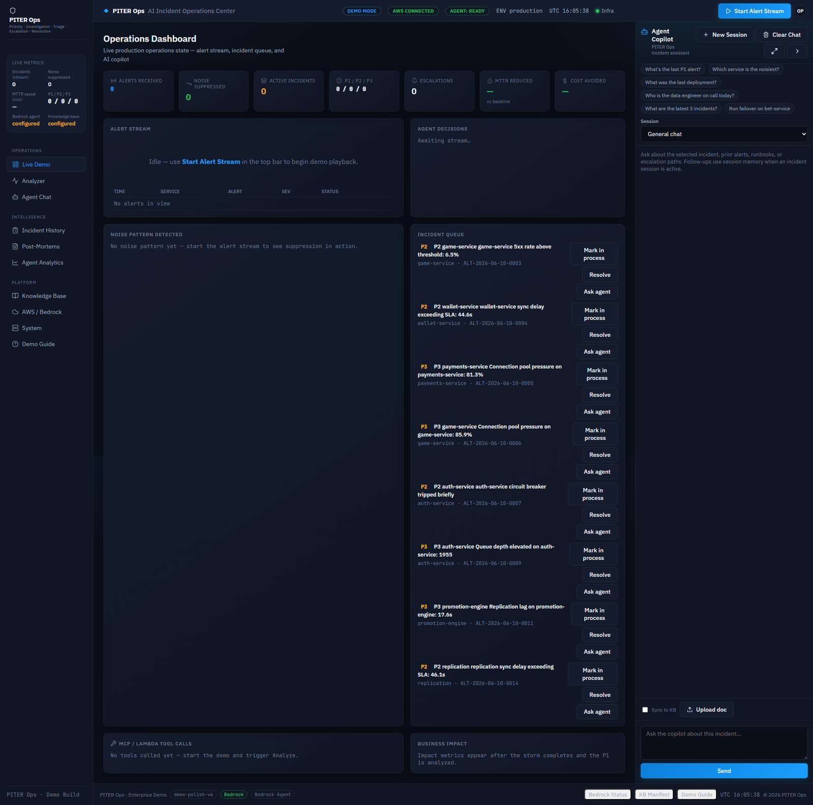

<details>
<summary><b>Interactive system diagram</b> — mermaid (renders on GitHub)</summary>

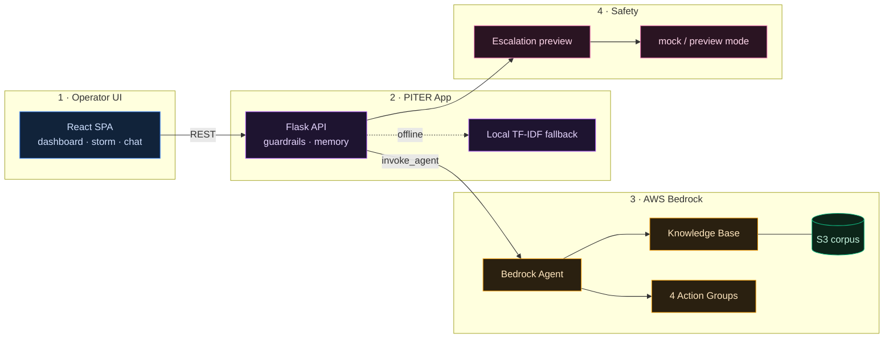

</details>

| Layer | Component | Role |
|-------|-----------|------|
| 🔵 **UI** | React 18 SPA | Dashboard, alert storm, triage panel, chat, escalation modal |
| 🟣 **API** | Flask + pydantic | `/api/triage`, `/api/chat`, session memory, structured analysis |
| 🟠 **Agent** | Bedrock Agent + alias | Orchestrates retrieval + tool calls via `invoke_agent` |
| 🟢 **RAG** | Bedrock Knowledge Base | Runbooks, services, incidents — [`knowledge_base/`](knowledge_base/) |
| 🟢 **Tools** | 4 Lambda action groups | Deploys, owners, similar incidents, escalation preview |
| 🩷 **Safety** | Notification dispatch | Preview/mock default; live gated by env + confirmation |

Deep dive: [`docs/architecture.md`](docs/architecture.md) · [`docs/ARCHITECTURE_DIAGRAMS.md`](docs/ARCHITECTURE_DIAGRAMS.md)

---

## Use cases

| # | Scenario | What happens | Evidence |
|---|----------|--------------|----------|
| 1 | **Alert storm** | Synthetic alerts flood in; P1 candidate surfaces at ~20s | [03](screenshots/final/03_alert_storm_running.png) · [04](screenshots/final/04_p1_detected.png) |
| 2 | **P1 triage** | Agent returns priority, correlation chain, action plan | [05](screenshots/final/05_investigation_detail_triage.png) · [16](screenshots/final/16_structured_analysis_panel.png) |
| 3 | **Grounded RAG** | Every step cites KB runbooks | [06](screenshots/final/06_rag_citations.png) |
| 4 | **Session memory** | Follow-up chat reuses incident context | [08](screenshots/final/08_memory_followup_context.png) |
| 5 | **Deploy correlation** | Tool links wallet deploy → replication lag | [demo chain](screenshots/final/demo-wallet-v4-12-3-correlation-chain.png) |
| 6 | **Safe escalation** | Preview recipients + checks; nothing sent by default | [09](screenshots/final/09_escalation_preview.png) |
| 7 | **Post-mortem** | Structured summary after resolution | [10](screenshots/final/10_post_mortem_summary.png) |

Presenter script: [`docs/demo_script.md`](docs/demo_script.md)

---

## End-to-end flow

<details>
<summary><b>Sequence diagram</b> — alert → triage → citations → escalation preview</summary>

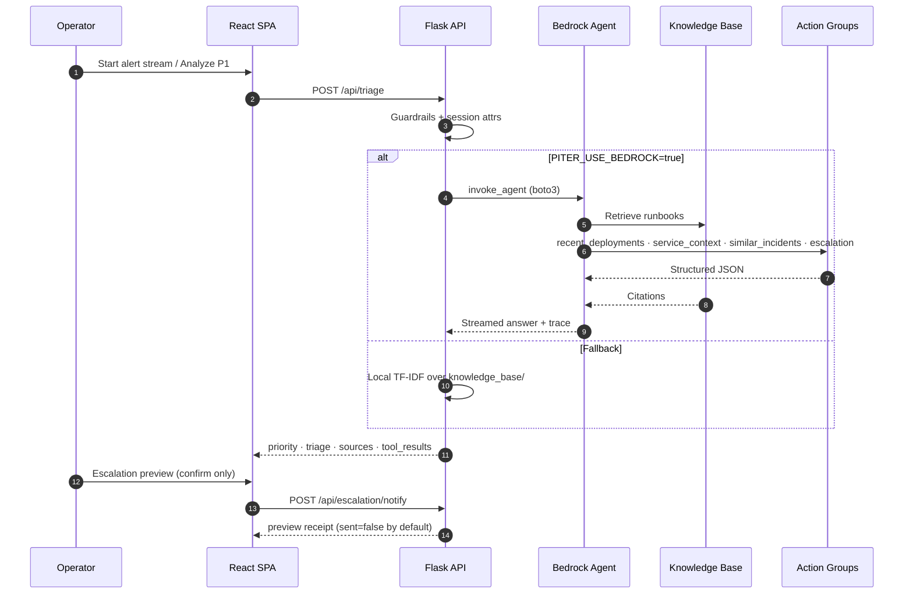

</details>

---

## Tools & integrations

### Bedrock Action Groups (production)

| Tool | Data source | Purpose |
|------|-------------|---------|
| `piter-recent-deployments` | `data/source/deploys.csv` | Correlate alert time with deploys |
| `piter-service-context` | `service_owners.csv`, `business_impact.json` | Owners, on-call, impact |
| `piter-similar-incidents` | `past_incidents.csv` | Historical match + MTTR |
| `piter-escalation` | `escalation_policies.json` | Escalation preview matrix |

Deploy Lambdas: [`scripts/aws_deploy_fix.ps1`](scripts/aws_deploy_fix.ps1) · OpenAPI schemas: [`action_groups/`](action_groups/)

### Local MCP layer (read-only)

| Tool | Purpose |
|------|---------|
| `get_recent_deployments` | Same contract as Lambda, no AWS |
| `get_service_context` | Ownership + dependencies |
| `find_similar_incidents` | Historical lookup |
| `get_escalation_recommendation` | Safe escalation preview |

```powershell
python -m mcp.server
python mcp/server.py --selftest
```

Details: [`mcp/README.md`](mcp/README.md)

### API surface (selected)

| Endpoint | Method | Purpose |
|----------|--------|---------|
| `/health` | GET | Liveness + deep Bedrock checks |
| `/api/triage` | POST | Structured incident analysis |
| `/api/chat` | POST | Agent chat with memory |
| `/api/escalation/notify` | POST | Preview/live dispatch (gated) |
| `/api/tools/status` | GET | Action group health |

Contract: [`docs/api_contract.md`](docs/api_contract.md)

---

## System prompts

| File | Used by |
|------|---------|
| [`infra/bedrock_agent_instructions.txt`](infra/bedrock_agent_instructions.txt) | Bedrock Agent orchestration instructions |
| [`app/bedrock_client.py`](app/bedrock_client.py) | KB retrieval prompt template override |

<details>
<summary><b>Agent instructions (excerpt)</b></summary>

```
You are PITER AiOps, a production-grade AI incident response assistant…

Mandatory workflow — always in this order:
1. Priority — classify P1–P4 using severity policy…
2. Investigation — use KB citations and Action Group tool results only
3. Triage — ordered, reversible steps first; cite the runbook
4. Escalation — when P1–P3; name on-call path from policy
5. Resolution — validation checks and post-incident follow-up

Grounding rules:
- Every remediation step must cite a runbook, policy, or incident record
- If evidence is missing, state "Not in knowledge base"
- Never invent owners, deploy versions, or escalation paths

Safety: REFUSE destructive steps (FLUSHALL, DROP, WAF disable…) without approval
```

Full text: [`infra/bedrock_agent_instructions.txt`](infra/bedrock_agent_instructions.txt)

</details>

---

## See it working

Click any screenshot to open full-size.

### Dashboard & alert storm

| Dashboard | Investigations | Alert storm | P1 detected |
|:---:|:---:|:---:|:---:|
| [](screenshots/final/01_dashboard.png) | [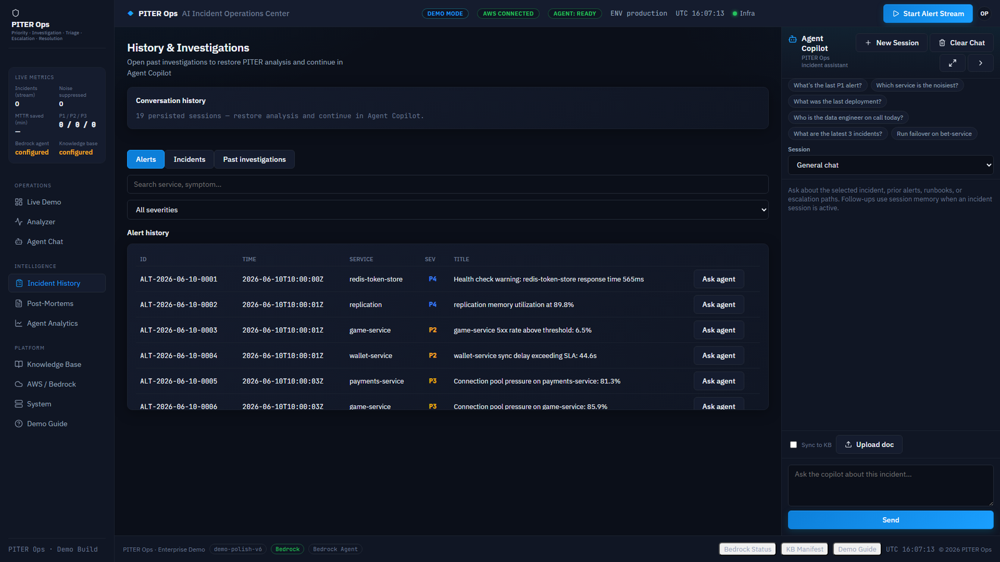](screenshots/final/02_investigations_table.png) | [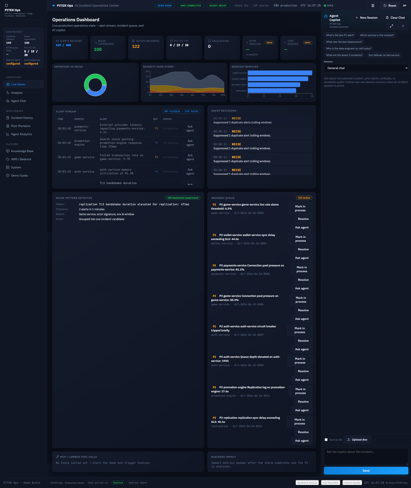](screenshots/final/03_alert_storm_running.png) | [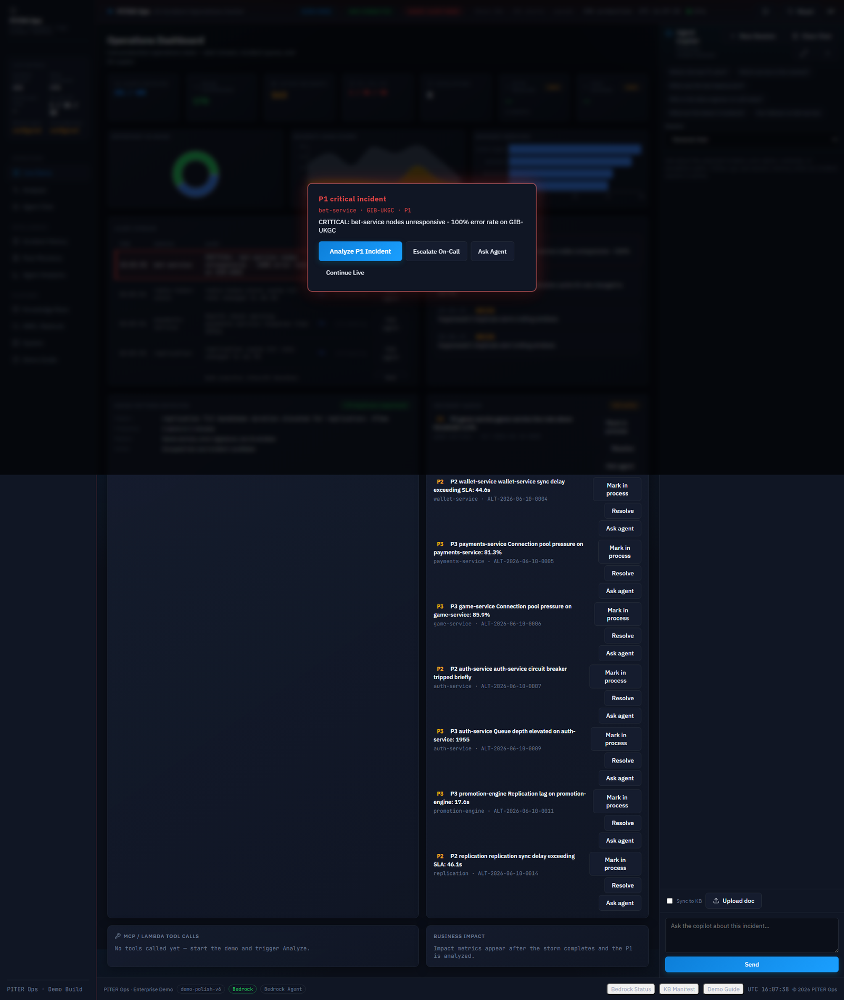](screenshots/final/04_p1_detected.png) |

### Triage, RAG & memory

| Triage detail | KB citations | Follow-up memory | Structured analysis |
|:---:|:---:|:---:|:---:|
| [](screenshots/final/05_investigation_detail_triage.png) | [](screenshots/final/06_rag_citations.png) | [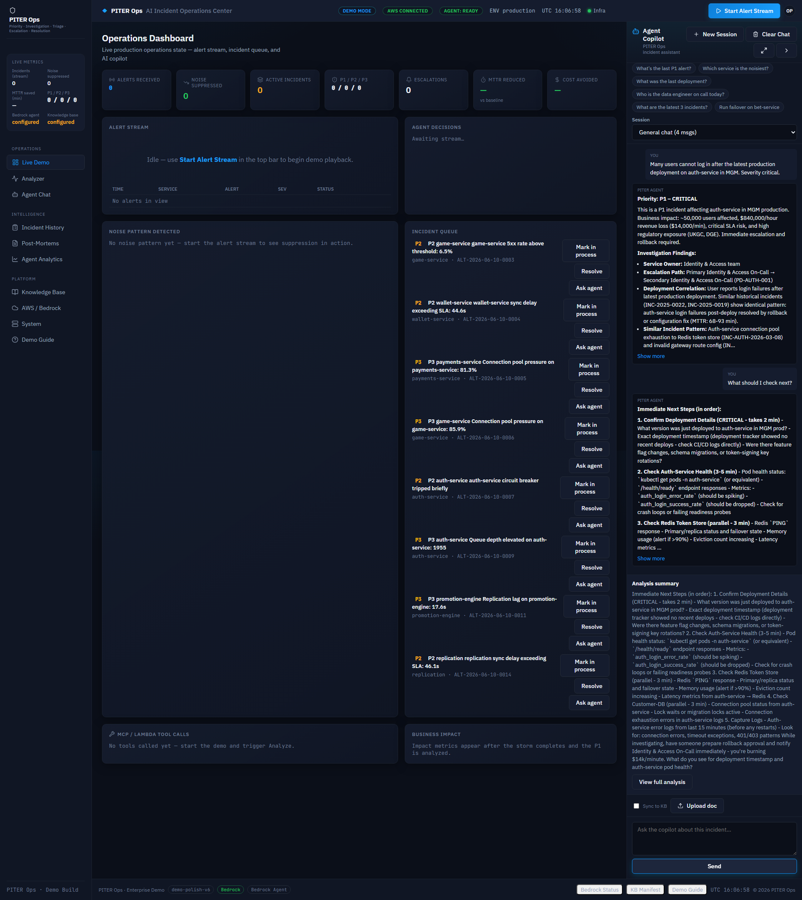](screenshots/final/08_memory_followup_context.png) | [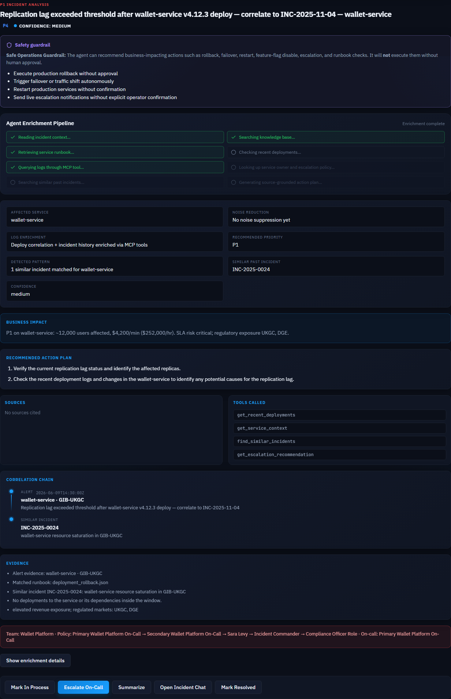](screenshots/final/16_structured_analysis_panel.png) |

### Escalation, KB & ops

| Escalation preview | Knowledge base | AWS status | Docker |
|:---:|:---:|:---:|:---:|
| [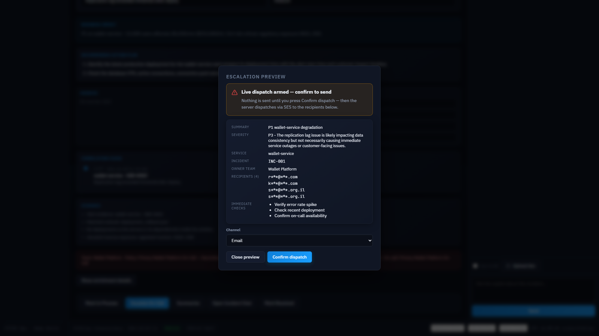](screenshots/final/09_escalation_preview.png) | [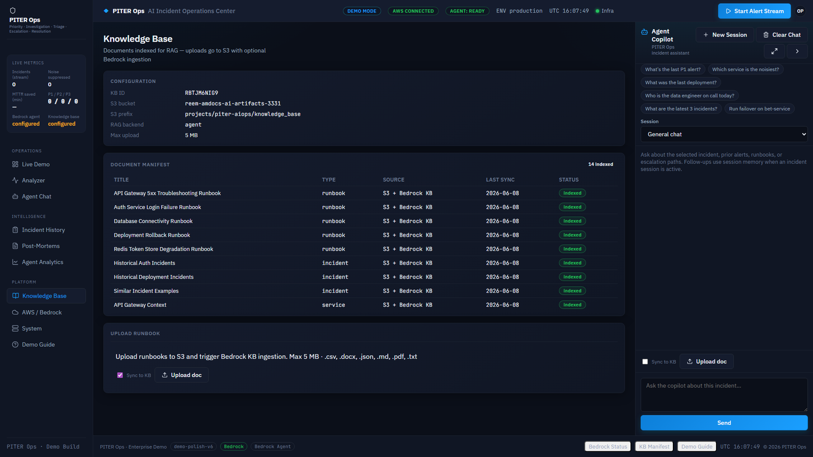](screenshots/final/11_knowledge_base.png) | [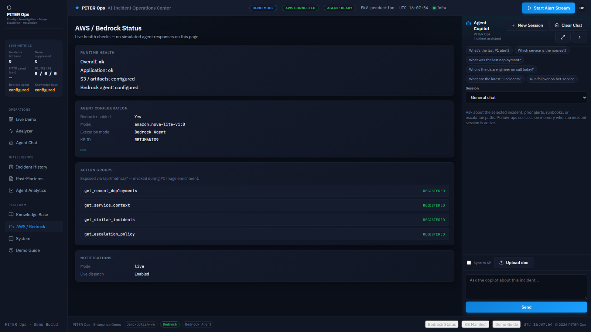](screenshots/final/13b_settings_aws_status.png) | [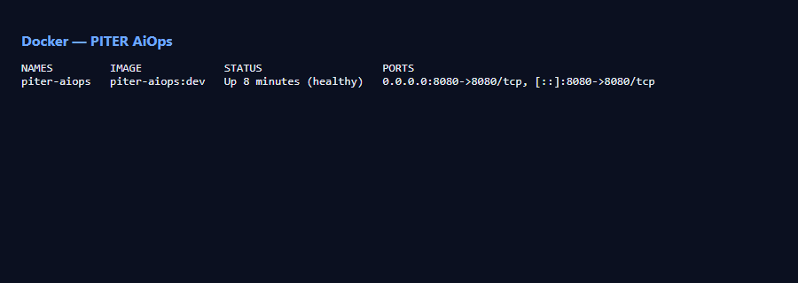](screenshots/final/15_docker_running.png) |

Capture guide: [`screenshots/README.md`](screenshots/README.md) · E2E: [`frontend/e2e/`](frontend/e2e/)

---

## Technology stack

| Area | Technology |
|------|------------|
| Backend | Python 3.12, Flask, pydantic, boto3 |
| Frontend | React 18, TypeScript, Vite |
| AI | Amazon Bedrock Agent + Knowledge Base |
| Tools | Lambda action groups + local MCP |
| Data | CSV/JSON ops datasets + S3 KB sync |
| Ops | Docker Compose, EC2 deploy scripts |
| Quality | pytest (~325), ruff, CI on GitHub Actions |

---

## Quick start

> **SPA build:** `app/static/spa/` is gitignored — run `npm run build` in `frontend/` before Docker.

```powershell
git clone https://github.com/reem-mor/piter-aiops.git
cd piter-aiops
py -3.12 -m pip install -r requirements-dev.txt
cd frontend; npm ci; npm run build; cd ..
docker compose up --build
# → http://localhost:8080 — Start Alert Stream → Analyze P1
```

<details>
<summary><b>Bedrock · EC2 · KB sync</b></summary>

```powershell
copy .env.example .env   # PITER_BEDROCK_* IDs — see docs/environment.md
$env:PITER_DOCKER_USE_BEDROCK = "true"
docker compose up --build

# KB sync (when AWS configured)
aws s3 sync knowledge_base/ s3://YOUR_BUCKET/projects/piter-aiops/knowledge_base/
python scripts/sync_knowledge_base.py --ingest --wait
```

EC2: [`docs/ec2_deployment.md`](docs/ec2_deployment.md) · set `PITER_DEMO_HOST` in env ([`docs/SECURITY.md`](docs/SECURITY.md))

</details>

---

## Verification

```powershell
py -3.12 -m pytest -q
py -3.12 scripts/verify_credentials.py          # optional — live AWS
py -3.12 scripts/verify_live_demo.py --base-url http://localhost:8080
```

CI: ruff + pytest on every push. External AWS calls are mocked in unit tests.

---

## Documentation

| Doc | Contents |
|-----|----------|
| [`docs/LOCAL_DEV.md`](docs/LOCAL_DEV.md) | Daily dev loop |
| [`docs/environment.md`](docs/environment.md) | Env vars & notification modes |
| [`docs/demo_script.md`](docs/demo_script.md) | 5-minute presenter flow |
| [`docs/troubleshooting.md`](docs/troubleshooting.md) | Bedrock / fallback errors |
| [`docs/SECURITY.md`](docs/SECURITY.md) | Public-repo hygiene |
| [`evaluation/SUBMISSION_PACKAGE.md`](evaluation/SUBMISSION_PACKAGE.md) | Course evidence index |
| [`TESTING.md`](TESTING.md) | Test matrix |

---

## License

MIT — see [`LICENSE`](LICENSE).
