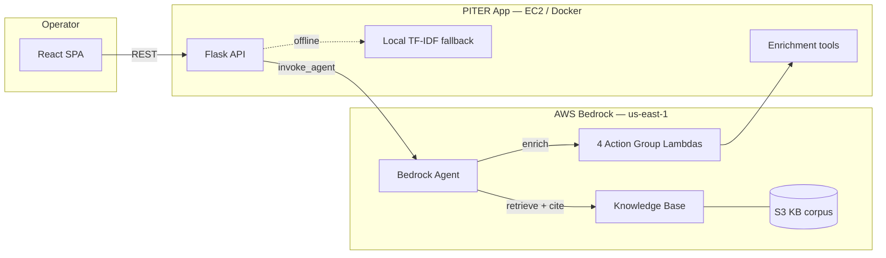
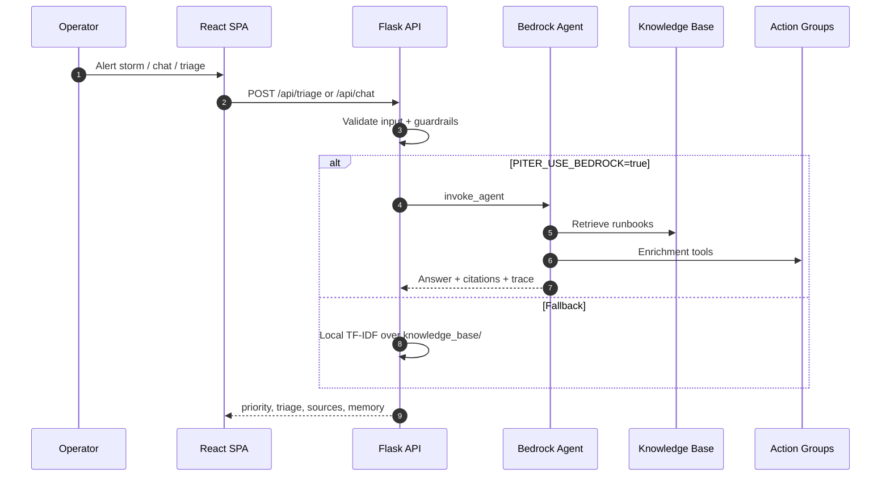
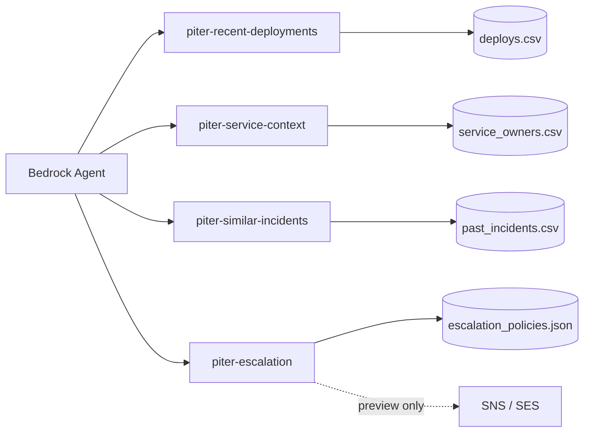

# Architecture diagrams

Supplement to [`architecture.md`](architecture.md). These diagrams were extracted from the portfolio README for maintainability.

## High-level containers

## Triage sequence

## Action groups

| Action group | Data | Purpose |
|--------------|------|---------|
| `piter-recent-deployments` | `deploys.csv` | Correlate alert with recent deploys |
| `piter-service-context` | owners + impact | On-call and business context |
| `piter-similar-incidents` | `past_incidents.csv` | Historical match + MTTR |
| `piter-escalation` | policies | Escalation preview (no auto-send) |
